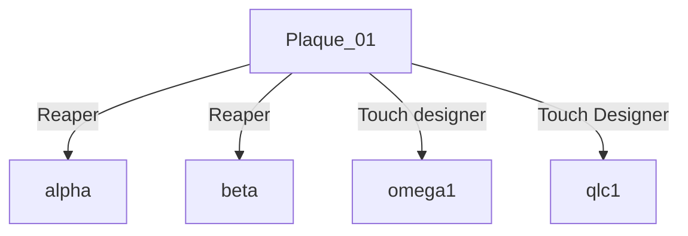
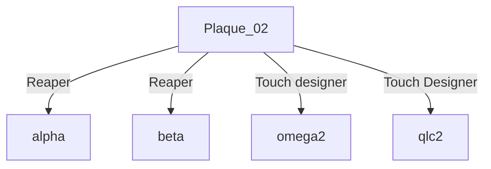
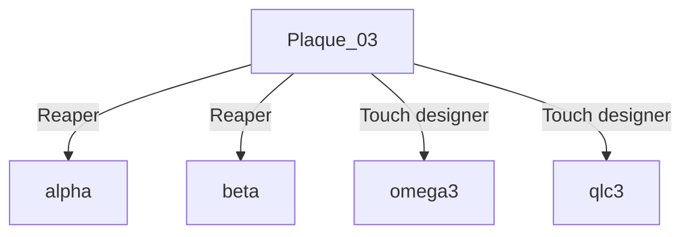

# Luminatura Arduino et Pure data

## Arduino 

Le code Arduino capte la capacitance de l'utilisateur, qui représente la capacité du corps à accumuler une charge électrique. Cette valeur est limitée à un maximum de 1000 pour garantir une calibration fiable. Une plaque en acier fonctionne comme capteur, détectant les changements de capacitance lorsque l'utilisateur la touche. Les données sont envoyées via les ports 8001, 8002 et 8003, à travers une connexion réseau Ethernet. PureData reçoit ces informations et les transforme en interactions sonores et visuelles en temps réel.

| Port | Fonction        | ID  |
| ---- | --------------- | --- |
| 8001 | Atom M5 Stack 1 | 01  |
| 8002 | Atom M5 Stack 2 | 02  |
| 8003 | Atom M5 Stack 3 | 03  |

### Les différents ports utilisés
| Port  | Fonction                                        |
| ----- | ----------------------------------------------- |
| 8001  | Atom M5 Stack 1                                 |
| 8002  | Atom M5 Stack 2                                 |
| 8003  | Atom M5 Stack 3                                 |
| 10001 | Qlc+                                            |
| 10002 | TouchDesigner - projection sur le sol           |
| 10003 | Reaper incluant le premier patch sur Plugdata   |
| 10004 | TouchDesigner - projection sur le mur           |
| 10005 | Reaper incluant le deuxième patch sur Plugdata  |
| 10007 | Reaper incluant le troisième patch sur Plugdata |

## PureData

Le code PureData récupère les données brutes d'Arduino en fonction de la capacitance de l'utilisateur. Ensuite, un effet de transition fluide est appliqué pour adoucir les valeurs. Il envoie ensuite deux types de données : les données brutes et les données booléennes. Ces informations sont envoyées vers des ports spécifiques, chacun étant destiné à un logiciel particulier sur le PC.

| Données brutes  | Données booléennes                             |
| ----- | ------------------------------------- |
| TouchDesigner - projection sur le sol | Qlc+                                  |
| TouchDesigner - projection sur le mur | Reaper incluant le fichier Plugdata (Plaque 01)   |
|  | Reaper incluant le fichier Plugdata (Plaque 02)   |
| | Reaper incluant le fichier Plugdata (Plaque 03)   |

